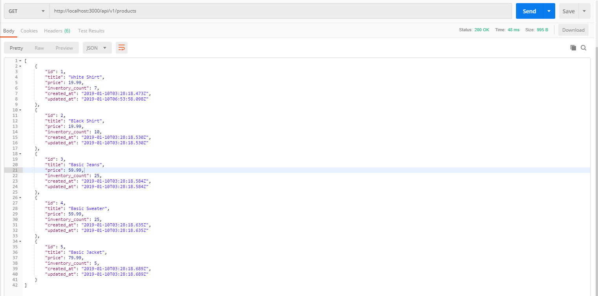
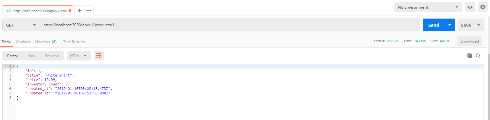
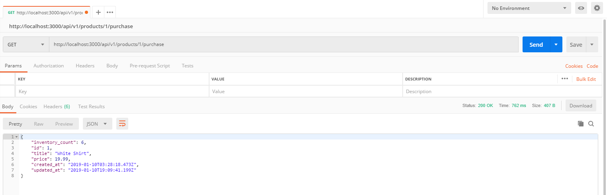

# Shopify Backend Developer Intern Challenge 2019

This repo contains my solution to the Shopify Online Marketplace Challenge for the Backend Developer Internship of Winter 2019. The description is [here](https://docs.google.com/document/d/1J49NAOIoWYOumaoQCKopPfudWI_jsQWVKlXmw1f1r-4/edit).

## Table of Contents

* [Dependencies](#Dependencies)
* [API](#API)
    * [All Products Fetch](#All-Products-Fetch)
    * [Single Product Fetch](#Single-Product-Fetch)
    * [Product Purchase](#Purchase-Product)

## Dependencies

This API was built on Ruby version 2.3.1p112 and Ruby on Rails version 5.2.2 and bundled with version 2.0.1. GEM specs can be found [here](Gemfile.lock).

* bootsnap (>= 1.1.0)
* byebug
* listen (>= 3.0.5, < 3.2)
* puma (~> 3.11)
* rails (~> 5.2.2)
* spring
* spring-watcher-listen (~> 2.0.0)
* sqlite3
* tzinfo-data

## API

The API responds with JSON code depending on an HTTP Get request.

**Note**: These were all tested using a simple manual test. The function themselves are not complex enough to warrant an automated test of each function.

### All Products Fetch

* Description: This feature will return a JSON containing all products currently in stock (inventory_count is greater than 0). 
* Get request: `api/v1/products`
* Response 200 (OK):
    * content type: `application/json; charset=UTF-8`
    * body: JSON of all products (List of dictionaries with correct data types).
* Test request: `api/v1/products`
* Test Description: Returned JSON data made up of all test data created in [seeds.rb](db/seeds.rb). 

### Single Product Fetch

* Description: This feature will return a JSON of the product of the id passed into the Get request. 
* Get request: `api/v1/products/:id`
* Response 200 (OK):
    * content type: `application/json; charset=UTF-8`
    * body: JSON of all product with id=:id (List of dictionaries with correct data types).
* Test request: `api/v1/products/1`
* Test Description: Returned JSON data made up of all test data created in [seeds.rb](db/seeds.rb) of product with id=:id=1. 

### Purchase Product
* Description: This feature will return a JSON of the product of the id passed into the Get request with one subtracted from its inventory (unless the item is not in stock)
* Get request: `api/v1/products/:id/purchase`
* Response 200 (OK):
    * content type: `application/json; charset=UTF-8`
    * body: JSON of all product with id=:id and one less inventory (List of dictionaries with correct data types).
* Test request: `api/v1/products/1/purchase`
* Test Description: Returned JSON data is the product of :id = 1, but with a subtracted inventory count (inventory_count = 7 - 1 = 6). 

